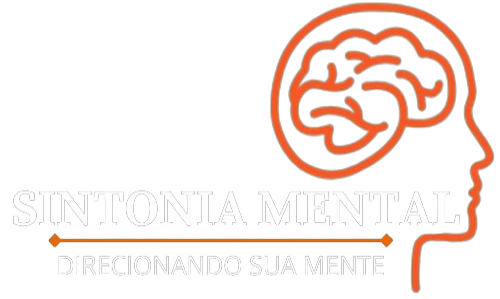

# Sintonia Mental

## 🧠 Sobre o Projeto

O **Sintonia Mental** é uma aplicação web dedicada a fornecer **apoio e recursos** para usuários com transtornos mentais, com um foco especial no **Transtorno do Déficit de Atenção e Hiperatividade (TDAH)**.

Nossa plataforma visa preencher a lacuna entre a necessidade de suporte e o acesso a profissionais qualificados, facilitando a marcação de consultas com especialistas da área de saúde mental e oferecendo um ambiente seguro para o aprendizado e a troca de informações.

## ✨ Propósito

> "Oferecer informações e apoio para melhorar a qualidade de vida das pessoas com transtornos mentais."

## 🎯 Principais Funcionalidades

*   **Conexão com Especialistas:** Facilitação de agendamento de consultas com profissionais de saúde mental.
*   **Telemedicina:** Consultas por vídeo ao vivo integradas diretamente na plataforma.
*   **Conteúdo Educacional:** Fornecimento de informações confiáveis e detalhadas sobre transtornos mentais, com ênfase no TDAH.

## 🛠️ Tecnologias Utilizadas

O projeto foi desenvolvido utilizando uma combinação robusta de linguagens e frameworks para garantir uma aplicação segura, escalável e com uma interface amigável.

| Categoria | Tecnologia | Detalhes |
| :--- | :--- | :--- |
| **Backend** | Python | Linguagem principal para a lógica de negócios. |
| **Framework Web** | Django | Framework de alto nível para desenvolvimento rápido e seguro. |
| **Frontend** | HTML, CSS, JavaScript | Base para a estrutura, estilo e interatividade da interface do usuário. |
| **Estilização** | Bootstrap | Framework de código aberto para design responsivo e rápido. |

## 📜 A História por Trás do Sintonia Mental

A inspiração para o Sintonia Mental é profundamente pessoal. A aplicação foi idealizada por um professor de informática, pai de um filho com **TDAH** e **Transtorno do Espectro Autista (TEA)**.

Ao observar as dificuldades que pais e responsáveis enfrentam para obter informações e o baixo índice de procura por tratamento adequado, o professor percebeu que muitos de seus alunos poderiam estar na mesma situação, sem nunca terem consultado um especialista.

Com o desejo de transformar essa experiência em uma ferramenta de ajuda, ele compartilhou sua visão com seus alunos mais dedicados. Um deles aceitou o desafio de desenvolver a aplicação, transformando a necessidade pessoal em um projeto com potencial de impacto social.

---

*Nota: O TDAH é um transtorno neurobiológico caracterizado por sintomas de desatenção, hiperatividade e impulsividade. O TEA engloba um conjunto de condições que afetam a comunicação e o comportamento social.*
