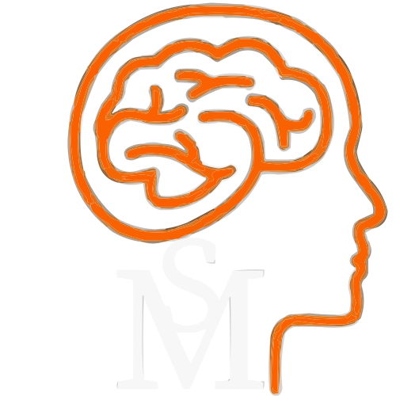

 

# Sintonia-Mental
 
  Aplicação web destinada a apoiar usuários com transtornos mentais, com ênfase no TDAH, facilitando consultas com               especialistas da área de saúde mental e fornecendo informações sobre o transtorno, além de oferecer consultas por vídeo ao      vivo.

# PROPOSITO 

  _Promover informações e suporte para a convivência com transtornos mentais._

# HISTORIA

Idealizada por um professor de informática que possui um filho com Transtorno do Déficit de Atenção e Hiperatividade (TDAH) e Transtorno do Espectro Autista (TEA), a aplicação surgiu da constatação de que muitos alunos também poderiam ter esses transtornos. O professor observou a dificuldade que pais e responsáveis enfrentam para obter informações sobre o assunto, devido ao pouco conhecimento e à baixa procura por tratamento. Ele percebeu que muitos dos alunos que suspeitava ter esses transtornos nunca haviam consultado um especialista da área. Após muito tempo desejando desenvolver esse projeto, o professor compartilhou sua ideia com os alunos mais dedicados, e um deles decidiu se comprometer a desenvolver a aplicação.

O TDAH é um transtorno neurobiológico caracterizado por sintomas de desatenção, hiperatividade e impulsividade. Já o TEA engloba uma série de condições caracterizadas por desafios na comunicação e comportamento.

# FERRAMENTAS 

* HTML
* CSS
* JAVASCRIPT
* PYTHON
* COM AS FRAMEWORKS
  > BOOTSTRAP  
  > DJANGO

  
